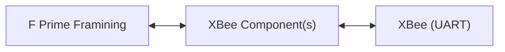

# Lesson: F Prime Communication Integration

In this exercise, you will integrate an **XBee 3 radio** into your F´ deployment. The goal is to implement a component (or set of components) that adapt the XBee radio for use with F´’s **[Communication Interface](https://fprime.jpl.nasa.gov/latest/docs/reference/communication-adapter-interface/))**.

The XBee radio provides a UART interface: data written to its UART port is transmitted over the radio, and data received over the radio is made available through UART.

---

## Learning Points

By completing this lesson, you will gain experience in:

1. Adapting radios and other communication devices for F´
2. Reusing standard components
3. Integrating components into existing deployments
4. (Optional) Authoring subtopologies
5. (Optional) Authoring component requirements

---

## Exercise

You should do the following

1. **Implement the ComInterface**
   * Create a component (or components) that provide the ports required by the ComInterface.
   * Use the XBee’s UART interface to send and receive packets.
   * Adapt the ComInterface to the XBee UART interface

3. **Connect to the Communication Stack**
   * Instantiate the XBee component in the topology
   * Select an appropriate subtopology for the communication stack
   * Attach your XBee component to your choice of framing F´ stack in the topology
    

5. **Test in Deployment**
   * Wire-up the XBee hardware to both your PI and laptop
   * Select (or build) the correct ground-side radio adaptation
   * Test!

---

## Hints

* F´ provides a **UART driver** component you can reuse directly.
* The XBee interface is simple: it **sends any data written to UART** and **delivers received data via UART**.

### Data Flow

## Optional Goals

* **Requirements**: Write full component requirements for your XBee component(s).
* **Extended Commands**: Add extra commands to configure or query the XBee radio.
* **Subtopology**: Package all your XBee components into a **subtopology** so they can be reused in other deployments.

## Relevant Documentation

- **[Communication Interface](https://fprime.jpl.nasa.gov/latest/docs/reference/communication-adapter-interface/)**
- **[Framing Subtopology](https://github.com/nasa/fprime/blob/bce0b5de796280bc6baa1c9db2fc9cd40898ad1b/Svc/Subtopologies/ComCcsds/ComCcsds.fpp#L108-L119)**
- **[Working with Subtopologies](https://fprime.jpl.nasa.gov/devel/docs/user-manual/design-patterns/subtopologies/)**
- **[Developing Subtopologies](https://fprime.jpl.nasa.gov/devel/docs/how-to/develop-subtopologies/)**

## Reference Implementation

The reference implementation for this lesson is under development.
When it is ready, it will be linked here:

> [!NOTE]
> **Reference Code Placeholder**
> A link to the reference solution will be provided once available.
