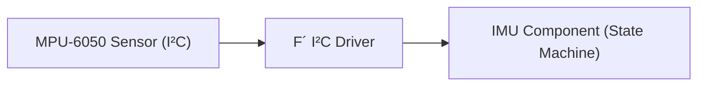

# Lesson: Modeling State Machines in FPP

In this exercise, you’ll design and implement a component that controls an **MPU-6050** IMU using an **FPP state machine**. The device should be driven through a sequence that prepares it for reliable operation, then sampled on a rate group.

The basic device flow is:
1. **Reset the device**
2. **Enable the data channels**
3. **Configure the device** (ranges)
4. **Read at a fixed rate** (via a rate group)

## Learning Points

* Use **FPP state machines** to model behavior and lifecycle.
* Apply **How-To guides** to learn F´ pattenrns.
* Control a real sensor using F´ drivers and structured component design.
* Data type design

## Exercise

1. **Design the IMU Component**

   * Define an FPP component that provides:
     * Rate group invocation
     * Telemetry outputs for acceleration/gyroscopic data (and temperature if desired)
     * Events for fault reporting
     * Range configuration parameters for accelerometer and gyroscope
   * Introduce data types for sensor data and parameters

2. **Model the Device Behavior with an FPP State Machine**

   * Create a state machine that walks through component states
   * Handle transitions between states
   * Handle errors that occur
   * Handle parameter updates

3. **Integrate into the Topology**
   * Wire the component to a **rate group** for periodic sampling.
   * Connect the component to the **I²C driver** and publish IMU data to the rest of the system via telemetry.

## Hints

* You’ll likely add **more than the basic How-To steps**:

  * Support **reconfiguration** at runtime (e.g., parameter changes)
  * Use **parameter** defaults for your range 
  * Emit **events** at each state transition to aid debugging
* F´ supplies an **I²C driver** you can reuse instead of writing one from scratch.
* We provide **helper functions** for common device protocol operations (for those who want them). See:

  * **ImuTypes.hpp** (TBD link)
  * **ImuHelpers.cpp** (TBD link)

> [!CAUTION]
> Using these helper functions will remove most of the need to understand the full datasheet.  However, you will still need to write function prototypes and call these functions appropriately.

### Data Flow

---

## Optional Goals

* **Subtopology**: Package the IMU component + I²C component into a reusable **subtopology**.
* **Unit Tests**: Write unit tests for the IMU component prompting state changes via ports and asserting behavior at a given state.
* **Requirements**: Author requirements for the component.

## Relevant Documentation

- **[MPU-6050 Datasheet](https://cdn-learn.adafruit.com/downloads/pdf/mpu6050-6-axis-accelerometer-and-gyro.pdf)**
- **[FPP State Machine How-To](TODO)**
- **[FPP State Machines (User Guide](https://nasa.github.io/fpp/fpp-users-guide.html#Defining-State-Machines)**
- **[FPP Component Parameters](https://nasa.github.io/fpp/fpp-users-guide.html#Defining-Components_Parameters)**
- **[Working with Subtopologies](https://fprime.jpl.nasa.gov/devel/docs/user-manual/design-patterns/subtopologies/)**
- **[Developing Subtopologies](https://fprime.jpl.nasa.gov/devel/docs/how-to/develop-subtopologies/)**

## Reference Implementation

The reference implementation for this lesson is under development.

> [!NOTE]
> **Reference Code Placeholder**
> Links to the IMU reference solution, **ImuTypes.hpp**, and **ImuHelpers.cpp** will be added here when available.

